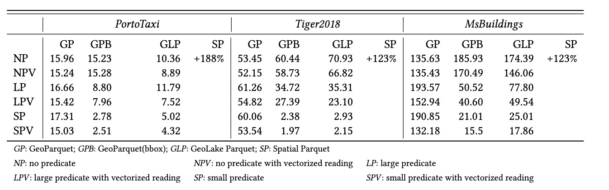

# GeoLake Parquet

Compare the performance of GeoLake Parquet with other spatial data formats:


The experiments run on 3 datasets:


|                 | Geometry Type   | Records | Points | APER |
|-----------------|-----------------|---------|--------|------|
| TIGER2018/Roads | MultiPoint      | 1.7M    | 83M    | 49   |
| Bananas         | MultiLineString | 18M     | 350M   | 19   |
| MSBuildings     | Polygon         | 125M    | 753M   | 6    |

APER: Average points in each record.


## Build & Run

```shell
./gradlew build
java -jar build/libs/geolake-benchmark-1.0-SNAPSHOT-all.jar
```
By default, it runs on a very small dataset which is too small to reflect the efficiency of GeoLake Parquet. 


In order to run the 3 large datasets mentioned previously, you need to download it first.

```shell
wget https://star.cs.ucr.edu/datasets/portotaxi/download.geojson.gz -O - | gzip -d > build/resources/main/source/portotaxi.geojson
wget https://star.cs.ucr.edu/datasets/TIGER2018/ROADS/download.geojson.gz -O - | gzip -d > build/resources/main/source/tiger_2018_roads.geojson
wget https://star.cs.ucr.edu/datasets/MSBuildings/download.geojson.gz -O - | gzip -d > build/resources/main/source/ucr_msbuildings.geojson
```

After downloading, you can run experiment on each dataset with the following commands: 
```shell
java -jar build/libs/geolake-benchmark-1.0-SNAPSHOT-all.jar portotaxi
java -jar build/libs/geolake-benchmark-1.0-SNAPSHOT-all.jar tiger
java -jar build/libs/geolake-benchmark-1.0-SNAPSHOT-all.jar msbuildings
```

The source code of GeoLake Parquet will be released in the [GeoLake](https://github.com/spatialx-project/geolake) project.